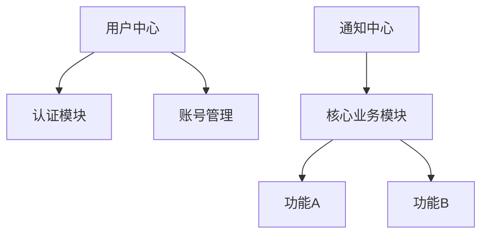
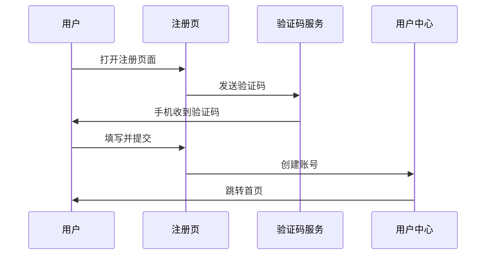

# 产品全貌

> 本文档描述产品当前的完整功能架构，代表最新全貌
> **「模块详情」表是全量已上线功能的权威清单（基线，快照视角）**：
> - 已有产品迁移（SOP-09 阶段 3.5）须把所有已上线功能录入本表
> - 新版本发布（SOP-07 推进到「已发布」）须把新交付功能合入本表
> 随版本迭代持续更新，变更记录见 [changelog.md](./changelog.md)
> 信息架构（IA）详见 [information-arch.md](./information-arch.md)
> 商业模式与价值主张见 [../business/business-model.md](../business/business-model.md)
> 技术架构见 [../tech-arch/overview.md](../tech-arch/overview.md)
> 用户研究见 [../market/user-research.md](../market/user-research.md)
> 最后更新：<!-- YYYY-MM-DD -->

---

## 产品定位

<!-- 一段话描述产品是什么、面向谁、解决什么问题
与 business-model.md 中的价值主张保持一致 -->

---

## 功能模块体系

### 模块全景

<!-- 建议用 Mermaid 图展示模块关系

-->

### 模块详情

| 模块名称 | 职责说明 | 核心功能点 | 依赖模块 | 引入版本 |
|---------|---------|----------|---------|---------|
| <!-- 如：用户中心 --> | <!-- 用户身份管理 --> | <!-- 注册/登录/账号设置 --> | <!-- 无 --> | v1.0.0 |
| <!-- 如：通知中心 --> | <!-- 消息触达 --> | <!-- 站内信/邮件/短信 --> | <!-- 用户中心 --> | v1.0.0 |

> **职责边界原则**：每个模块只负责其核心职责，模块间通过明确的接口交互，避免职责重叠

---

## 用户角色与权限体系

<!-- 产品中存在的用户角色及其权限范围

| 角色 | 描述 | 可访问模块 | 特殊权限 |
|------|------|----------|---------|
| <!-- 如：普通用户 --> | <!-- --> | <!-- --> | <!-- --> |
| <!-- 如：管理员 --> | <!-- --> | <!-- 全部 --> | <!-- 用户管理/系统配置 --> |
-->

---

## 核心用户旅程

<!-- 描述主要用户角色完成核心任务的端到端流程

### 旅程一：{旅程名称}

**用户角色**：<!-- -->
**触发条件**：<!-- -->

**关键决策点**：<!-- 用户在旅程中可能放弃的节点和原因 -->
**成功完成标志**：<!-- 什么状态代表旅程成功完成 -->
-->

---

## 核心业务流程

<!-- 产品支撑的核心业务流程（系统协作视角，区别于用户旅程的用户视角）

### 流程一：{流程名称}

**触发条件**：<!-- -->
**参与模块**：<!-- -->
**流程步骤**：
1. <!-- 步骤1：哪个模块做什么 -->
2. <!-- 步骤2 -->

**异常处理**：<!-- 流程中断时的处理方式 -->
-->

---

## 系统边界

### 产品边界

**包含**：
<!-- - 模块/功能1 -->

**不包含（明确排除）**：
<!-- - 如：数据分析平台（独立产品）-->

### 外部集成

| 外部系统 | 集成方式 | 数据流向 | 集成版本 | 状态 |
|---------|---------|---------|---------|------|
| <!-- 如：短信服务商 --> | API 调用 | 单向（发出） | v1.0.0 | 活跃 |

> 状态：活跃 / 已废弃（注明替换版本）/ 规划中

---

## 产品演进路线（Roadmap 概览）

> 详细版本规划见 versions/ 目录，此处仅描述战略方向

| 时间范围 | 方向 | 说明 |
|---------|------|------|
| 近期（当前版本）| <!-- --> | <!-- 正在做的事 --> |
| 中期（3-6个月）| <!-- --> | <!-- 计划方向 --> |
| 长期（6个月+）| <!-- --> | <!-- 战略方向 --> |

---

## 说明

- 本文档代表产品当前全貌，不记录历史状态
- 每次版本迭代新增功能模块后，同步更新「模块详情」表和「模块全景」图
- 发生重大架构调整时，在 changelog.md 中追加变更记录
- AI 在进行产品相关工作前，应先读取本文档了解产品全貌
