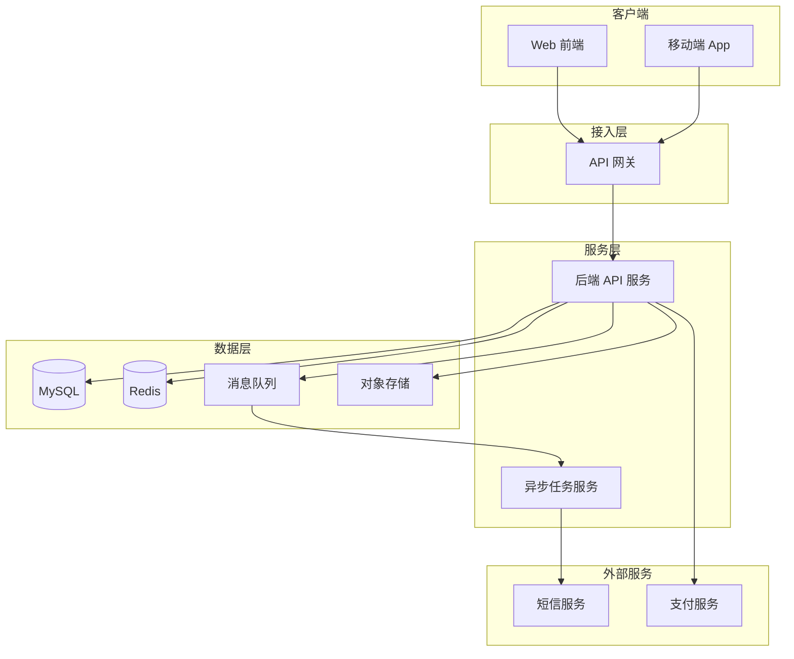

# 技术架构全貌

> 本文档描述产品当前的完整技术架构，代表最新全貌
> 随版本迭代持续更新，变更记录见 [changelog.md](./changelog.md)
> 技术决策记录（ADR）见 [decisions/](./decisions/)
> 产品架构见 [../product-arch/overview.md](../product-arch/overview.md)
> 研发工程文档见 [../../engineering/README.md](../../engineering/README.md)
> 最后更新：<!-- YYYY-MM-DD -->

---

## 架构概述

<!-- 一段话描述整体技术架构的核心决策和设计理念
例如：采用前后端分离架构，后端提供 RESTful API，
前端 SPA + 移动端原生应用，通过 API 网关统一接入，
数据层以 MySQL 为主，Redis 做缓存，对象存储处理文件资源 -->

---

## 技术栈总览

| 层次 | 技术选型 | 版本 | 选型说明 |
|------|---------|------|---------|
| 前端框架 | <!-- 如：React --> | <!-- --> | <!-- 选择原因 --> |
| 移动端 | <!-- 如：React Native / Flutter --> | <!-- --> | <!-- --> |
| 后端框架 | <!-- 如：Spring Boot / Gin --> | <!-- --> | <!-- --> |
| 数据库 | <!-- 如：MySQL 8.0 --> | <!-- --> | <!-- --> |
| 缓存 | <!-- 如：Redis --> | <!-- --> | <!-- --> |
| 消息队列 | <!-- 如：Kafka / RabbitMQ --> | <!-- --> | <!-- 无则填「无」 --> |
| 对象存储 | <!-- 如：阿里云 OSS --> | <!-- --> | <!-- --> |
| 搜索引擎 | <!-- 如：Elasticsearch --> | <!-- --> | <!-- 无则填「无」 --> |
| 容器化 | <!-- 如：Docker + Kubernetes --> | <!-- --> | <!-- --> |
| CI/CD | <!-- 如：GitHub Actions / Jenkins --> | <!-- --> | <!-- --> |
| 监控 | <!-- 如：Prometheus + Grafana --> | <!-- --> | <!-- --> |

> 详细版本和依赖管理见 engineering/docs/tech-stack.md

---

## 系统架构图

<!-- 描述系统各组件的关系和部署方式

-->

---

## 模块划分

| 服务/模块 | 职责 | 技术栈 | 对应工程仓库 |
|---------|------|--------|-----------|
| <!-- 如：API 服务 --> | <!-- 核心业务逻辑和接口 --> | <!-- Node.js/Go --> | <!-- engineering/backend --> |
| <!-- 如：Web 前端 --> | <!-- 用户界面 --> | <!-- React --> | <!-- engineering/frontend --> |
| <!-- 如：异步任务 --> | <!-- 通知发送、数据处理 --> | <!-- 同 API 服务 --> | <!-- engineering/backend --> |

---

## 可观测性设计

| 维度 | 方案 | 说明 |
|------|------|------|
| 日志 | <!-- 如：结构化 JSON 日志，统一格式 --> | <!-- 日志级别规范、敏感信息脱敏要求 --> |
| 指标 | <!-- 如：Prometheus 埋点，核心接口 QPS/延迟 --> | <!-- 关键监控指标 --> |
| 链路追踪 | <!-- 如：OpenTelemetry + Jaeger --> | <!-- 分布式追踪方案，无则填「暂未引入」 --> |
| 告警 | <!-- 如：Grafana 告警 + 企业微信通知 --> | <!-- 告警阈值和通知渠道 --> |

---

## 部署架构

### 环境划分

| 环境 | 说明 | 部署方式 |
|------|------|---------|
| dev | 本地开发 | 本地启动 |
| staging | 测试/预发 | <!-- 如：K8s 自动部署 --> |
| prod | 生产 | <!-- 如：K8s 蓝绿部署 --> |

### 高可用设计

<!-- 关键服务的高可用方案
- API 服务：<!-- 如：多实例无状态部署，负载均衡 -->
- 数据库：<!-- 如：主从复制，读写分离 -->
- 缓存：<!-- 如：Redis 主从 + 哨兵模式 -->
-->

---

## 安全架构

| 安全层面 | 方案 | 说明 |
|---------|------|------|
| 认证 | <!-- 如：JWT Token --> | <!-- 有效期、刷新策略 --> |
| 授权 | <!-- 如：RBAC 基于角色 --> | <!-- --> |
| 传输安全 | HTTPS | 全站 HTTPS，禁止 HTTP |
| 数据加密 | <!-- 如：敏感字段 AES 加密 --> | <!-- 手机号、身份证等 --> |
| API 防护 | <!-- 如：限流 + 防重放 --> | <!-- --> |
| 数据合规 | <!-- 如：用户数据存储在境内服务器，满足等保二级 --> | <!-- 合规要求来源 --> |
| 依赖安全 | <!-- 如：定期扫描依赖漏洞 --> | <!-- --> |

---

## 关键技术决策索引

> 详细决策过程见 [decisions/](./decisions/) 目录下的 ADR 文件

| 决策编号 | 决策主题 | 状态 | 引入版本 |
|---------|---------|------|---------|
| [ADR-001](./decisions/ADR-001-example.md) | <!-- 决策主题 --> | 已接受/已废弃 | v1.0.0 |

---

## 性能基线

<!-- 系统当前已验证的性能指标，作为后续版本的性能基线参考

| 指标 | 当前值 | 测试条件 | 测试版本 |
|------|--------|---------|---------|
| 核心接口 p99 响应时间 | <!-- 如：200ms --> | <!-- 并发 500 --> | v1.0.0 |
| 系统吞吐量（QPS） | <!-- --> | <!-- --> | <!-- --> |
| 数据库最大连接数 | <!-- --> | <!-- --> | <!-- --> |
-->

---

## 说明

- 本文档代表技术架构当前全貌，不记录历史状态
- 每次版本迭代涉及架构调整时，同步更新本文档并在 changelog.md 追加记录
- 重大技术决策须在 decisions/ 目录下创建对应 ADR 文件
- AI 在做技术方案设计前，应先读取本文档了解技术架构基线
→ 变更记录见 [changelog.md](./changelog.md)
